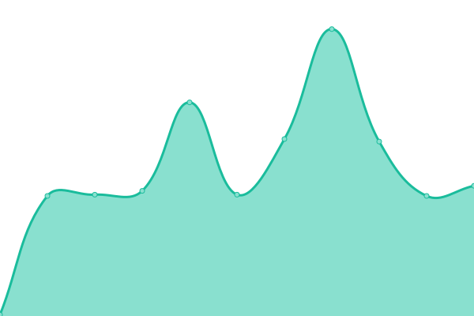
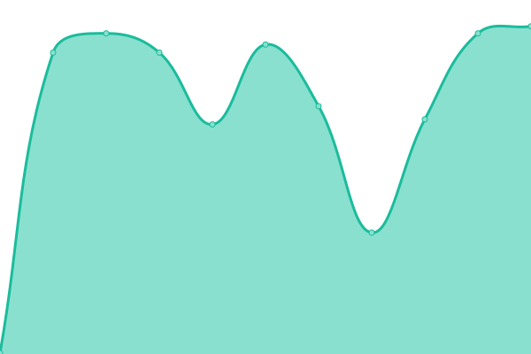
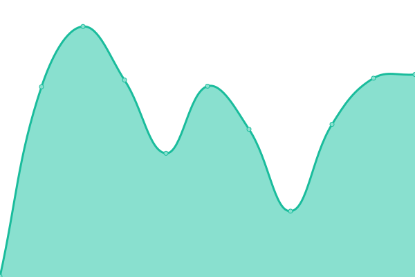
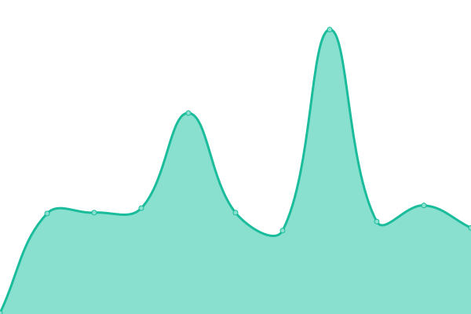
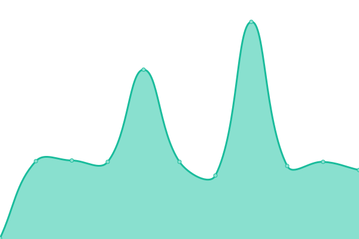
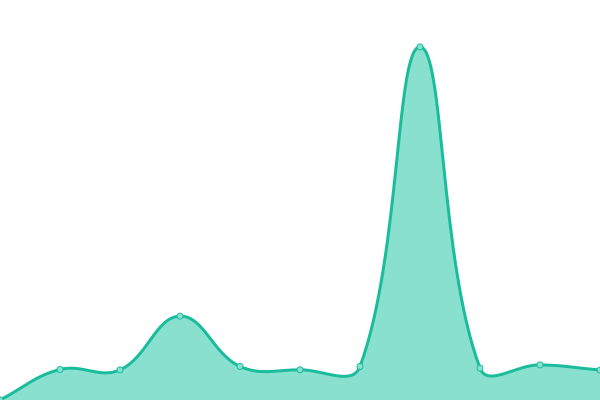
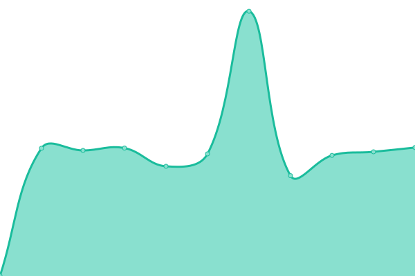
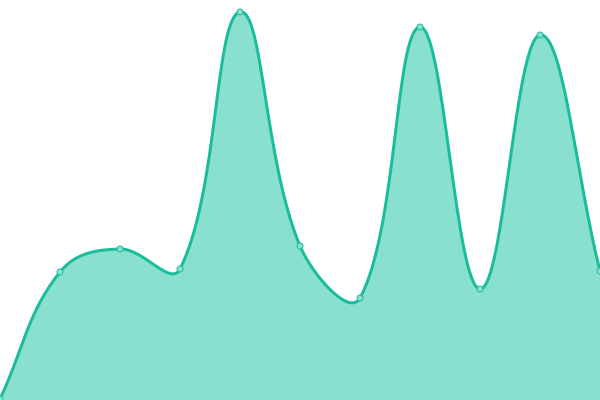

# [📈 Live Status](https://windstatus.github.io/windscribe-vpn-status-uptime-monitor): <!--live status--> **🟧 Partial outage**

This repository contains the open-source uptime monitor and status page for [windstatus](https://windstatus.github.io/windscribe-vpn-status-uptime-monitor), powered by [Upptime](https://github.com/upptime/upptime).

With [Upptime](https://upptime.js.org), you can get your own unlimited and free uptime monitor and status page, powered entirely by a GitHub repository. We use [Issues](https://github.com/windstatus/windscribe-vpn-status-uptime-monitor/issues) as incident reports, [Actions](https://github.com/windstatus/windscribe-vpn-status-uptime-monitor/actions) as uptime monitors, and [Pages](https://windstatus.github.io/windscribe-vpn-status-uptime-monitor) for the status page.

<!--start: status pages-->
<!-- This summary is generated by Upptime (https://github.com/upptime/upptime) -->
<!-- Do not edit this manually, your changes will be overwritten -->
<!-- prettier-ignore -->
| URL | Status | History | Response Time | Uptime |
| --- | ------ | ------- | ------------- | ------ |
|  [US Central Dallas (Ranch)](https://us-central-014.whiskergalaxy.com:6363/latency) | 🟥 Down | [us-central-dallas-ranch.yml](https://github.com/windstatus/windscribe-vpn-status-uptime-monitor/commits/HEAD/history/us-central-dallas-ranch.yml) | 

 0ms
     
 | 

<a href="https://windstatus.github.io/windscribe-vpn-status-uptime-monitor/history/us-central-dallas-ranch">0.00%</a>
    

|  [US Central Atlanta (Mountain)](https://us-central-013.whiskergalaxy.com:6363/latency) | 🟥 Down | [us-central-atlanta-mountain.yml](https://github.com/windstatus/windscribe-vpn-status-uptime-monitor/commits/HEAD/history/us-central-atlanta-mountain.yml) | 

 0ms
     
 | 

<a href="https://windstatus.github.io/windscribe-vpn-status-uptime-monitor/history/us-central-atlanta-mountain">0.00%</a>
    

|  [US Central Denver (Barley)](https://us-central-106.whiskergalaxy.com:6363/latency) | 🟩 Up | [us-central-denver-barley.yml](https://github.com/windstatus/windscribe-vpn-status-uptime-monitor/commits/HEAD/history/us-central-denver-barley.yml) | 

 219ms
     
 | 

<a href="https://windstatus.github.io/windscribe-vpn-status-uptime-monitor/history/us-central-denver-barley">96.16%</a>
    

|  [US Central Dallas (BBQ)](https://us-central-055.whiskergalaxy.com:6363/latency) | 🟩 Up | [us-central-dallas-bbq.yml](https://github.com/windstatus/windscribe-vpn-status-uptime-monitor/commits/HEAD/history/us-central-dallas-bbq.yml) | 

 234ms
     
 | 

<a href="https://windstatus.github.io/windscribe-vpn-status-uptime-monitor/history/us-central-dallas-bbq">100.00%</a>
    

|  [US Central Atlanta (Piedmont)](https://us-central-107.whiskergalaxy.com:6363/latency) | 🟩 Up | [us-central-atlanta-piedmont.yml](https://github.com/windstatus/windscribe-vpn-status-uptime-monitor/commits/HEAD/history/us-central-atlanta-piedmont.yml) | 

 204ms
     
 | 

<a href="https://windstatus.github.io/windscribe-vpn-status-uptime-monitor/history/us-central-atlanta-piedmont">75.08%</a>
    

|  [US Central Kansas City (Glinda)](https://us-central-097.whiskergalaxy.com:6363/latency) | 🟩 Up | [us-central-kansas-city-glinda.yml](https://github.com/windstatus/windscribe-vpn-status-uptime-monitor/commits/HEAD/history/us-central-kansas-city-glinda.yml) | 

 464ms
     
 | 

<a href="https://windstatus.github.io/windscribe-vpn-status-uptime-monitor/history/us-central-kansas-city-glinda">100.00%</a>
    

|  [US Central Dallas (Trinity)](https://us-central-104.whiskergalaxy.com:6363/latency) | 🟩 Up | [us-central-dallas-trinity.yml](https://github.com/windstatus/windscribe-vpn-status-uptime-monitor/commits/HEAD/history/us-central-dallas-trinity.yml) | 

 176ms
     
 | 

<a href="https://windstatus.github.io/windscribe-vpn-status-uptime-monitor/history/us-central-dallas-trinity">93.09%</a>
    

|  [US Central Houston (Space City)](https://us-central-108.whiskergalaxy.com:6363/latency) | 🟩 Up | [us-central-houston-space-city.yml](https://github.com/windstatus/windscribe-vpn-status-uptime-monitor/commits/HEAD/history/us-central-houston-space-city.yml) | 

 192ms
     
 | 

<a href="https://windstatus.github.io/windscribe-vpn-status-uptime-monitor/history/us-central-houston-space-city">89.73%</a>
    

|  [US East Chicago (Cub)](https://us-east-015.whiskergalaxy.com:6363/latency) | 🟥 Down | [us-east-chicago-cub.yml](https://github.com/windstatus/windscribe-vpn-status-uptime-monitor/commits/HEAD/history/us-east-chicago-cub.yml) | 

 0ms
     
 | 

<a href="https://windstatus.github.io/windscribe-vpn-status-uptime-monitor/history/us-east-chicago-cub">0.00%</a>
    

|  [US East New York (Empire)](https://us-east-013.whiskergalaxy.com:6363/latency) | 🟩 Up | [us-east-new-york-empire.yml](https://github.com/windstatus/windscribe-vpn-status-uptime-monitor/commits/HEAD/history/us-east-new-york-empire.yml) | 

 163ms
     
 | 

<a href="https://windstatus.github.io/windscribe-vpn-status-uptime-monitor/history/us-east-new-york-empire">71.85%</a>
    

|  [US East Chicago (The L)](https://us-east-019.whiskergalaxy.com:6363/latency) | 🟥 Down | [us-east-chicago-the-l.yml](https://github.com/windstatus/windscribe-vpn-status-uptime-monitor/commits/HEAD/history/us-east-chicago-the-l.yml) | 

 0ms
     
 | 

<a href="https://windstatus.github.io/windscribe-vpn-status-uptime-monitor/history/us-east-chicago-the-l">0.00%</a>
    

|  [US East Miami (Vice)](https://us-east-012.whiskergalaxy.com:6363/latency) | 🟩 Up | [us-east-miami-vice.yml](https://github.com/windstatus/windscribe-vpn-status-uptime-monitor/commits/HEAD/history/us-east-miami-vice.yml) | 

 176ms
     
 | 

<a href="https://windstatus.github.io/windscribe-vpn-status-uptime-monitor/history/us-east-miami-vice">75.13%</a>
    

|  [US East Cleveland (Brown)](https://us-east-112.whiskergalaxy.com:6363/latency) | 🟩 Up | [us-east-cleveland-brown.yml](https://github.com/windstatus/windscribe-vpn-status-uptime-monitor/commits/HEAD/history/us-east-cleveland-brown.yml) | 

 1566ms
     
 | 

<a href="https://windstatus.github.io/windscribe-vpn-status-uptime-monitor/history/us-east-cleveland-brown">99.55%</a>
    

|  [US East New Jersey (Situation)](https://us-east-020.whiskergalaxy.com:6363/latency) | 🟥 Down | [us-east-new-jersey-situation.yml](https://github.com/windstatus/windscribe-vpn-status-uptime-monitor/commits/HEAD/history/us-east-new-jersey-situation.yml) | 

 0ms
     
 | 

<a href="https://windstatus.github.io/windscribe-vpn-status-uptime-monitor/history/us-east-new-jersey-situation">0.00%</a>
    

|  [US East Miami (Snow)](https://us-east-028.whiskergalaxy.com:6363/latency) | 🟩 Up | [us-east-miami-snow.yml](https://github.com/windstatus/windscribe-vpn-status-uptime-monitor/commits/HEAD/history/us-east-miami-snow.yml) | 

 191ms
     
 | 

<a href="https://windstatus.github.io/windscribe-vpn-status-uptime-monitor/history/us-east-miami-snow">83.05%</a>
    

|  [US East Buffalo (Bill)](https://us-east-045.whiskergalaxy.com:6363/latency) | 🟩 Up | [us-east-buffalo-bill.yml](https://github.com/windstatus/windscribe-vpn-status-uptime-monitor/commits/HEAD/history/us-east-buffalo-bill.yml) | 

 199ms
     
 | 

<a href="https://windstatus.github.io/windscribe-vpn-status-uptime-monitor/history/us-east-buffalo-bill">98.62%</a>
    

|  [US East Boston (MIT)](https://us-east-051.whiskergalaxy.com:6363/latency) | 🟩 Up | [us-east-boston-mit.yml](https://github.com/windstatus/windscribe-vpn-status-uptime-monitor/commits/HEAD/history/us-east-boston-mit.yml) | 

 297ms
     
 | 

<a href="https://windstatus.github.io/windscribe-vpn-status-uptime-monitor/history/us-east-boston-mit">100.00%</a>
    

|  [US East Charlotte (Earnhardt)](https://us-east-040.whiskergalaxy.com:6363/latency) | 🟩 Up | [us-east-charlotte-earnhardt.yml](https://github.com/windstatus/windscribe-vpn-status-uptime-monitor/commits/HEAD/history/us-east-charlotte-earnhardt.yml) | 

 267ms
     
 | 

<a href="https://windstatus.github.io/windscribe-vpn-status-uptime-monitor/history/us-east-charlotte-earnhardt">100.00%</a>
    

|  [US East Chicago (Wrigley)](https://us-east-128.whiskergalaxy.com:6363/latency) | 🟩 Up | [us-east-chicago-wrigley.yml](https://github.com/windstatus/windscribe-vpn-status-uptime-monitor/commits/HEAD/history/us-east-chicago-wrigley.yml) | 

 153ms
     
 | 

<a href="https://windstatus.github.io/windscribe-vpn-status-uptime-monitor/history/us-east-chicago-wrigley">75.84%</a>
    

|  [US East Washington DC (Precedent)](https://us-east-089.whiskergalaxy.com:6363/latency) | 🟥 Down | [us-east-washington-dc-precedent.yml](https://github.com/windstatus/windscribe-vpn-status-uptime-monitor/commits/HEAD/history/us-east-washington-dc-precedent.yml) | 

 0ms
     
 | 

<a href="https://windstatus.github.io/windscribe-vpn-status-uptime-monitor/history/us-east-washington-dc-precedent">0.00%</a>
    

|  [US East Miami (Florida Man)](https://us-east-129.whiskergalaxy.com:6363/latency) | 🟩 Up | [us-east-miami-florida-man.yml](https://github.com/windstatus/windscribe-vpn-status-uptime-monitor/commits/HEAD/history/us-east-miami-florida-man.yml) | 

 207ms
     
 | 

<a href="https://windstatus.github.io/windscribe-vpn-status-uptime-monitor/history/us-east-miami-florida-man">70.87%</a>
    

|  [US East New York (Insomnia)](https://us-east-068.whiskergalaxy.com:6363/latency) | 🟩 Up | [us-east-new-york-insomnia.yml](https://github.com/windstatus/windscribe-vpn-status-uptime-monitor/commits/HEAD/history/us-east-new-york-insomnia.yml) | 

 280ms
     
 | 

<a href="https://windstatus.github.io/windscribe-vpn-status-uptime-monitor/history/us-east-new-york-insomnia">100.00%</a>
    

|  [US East Orlando (Tofu Driver)](https://us-east-052.whiskergalaxy.com:6363/latency) | 🟩 Up | [us-east-orlando-tofu-driver.yml](https://github.com/windstatus/windscribe-vpn-status-uptime-monitor/commits/HEAD/history/us-east-orlando-tofu-driver.yml) | 

 224ms
     
 | 

<a href="https://windstatus.github.io/windscribe-vpn-status-uptime-monitor/history/us-east-orlando-tofu-driver">81.56%</a>
    

|  [US East Philadelphia (Fresh Prince)](https://us-east-061.whiskergalaxy.com:6363/latency) | 🟩 Up | [us-east-philadelphia-fresh-prince.yml](https://github.com/windstatus/windscribe-vpn-status-uptime-monitor/commits/HEAD/history/us-east-philadelphia-fresh-prince.yml) | 

 330ms
     
 | 

<a href="https://windstatus.github.io/windscribe-vpn-status-uptime-monitor/history/us-east-philadelphia-fresh-prince">99.86%</a>
    

|  [US East Tampa (Cuban Sandwich)](https://us-east-110.whiskergalaxy.com:6363/latency) | 🟩 Up | [us-east-tampa-cuban-sandwich.yml](https://github.com/windstatus/windscribe-vpn-status-uptime-monitor/commits/HEAD/history/us-east-tampa-cuban-sandwich.yml) | 

 284ms
     
 | 

<a href="https://windstatus.github.io/windscribe-vpn-status-uptime-monitor/history/us-east-tampa-cuban-sandwich">100.00%</a>
    

|  [US East Detroit (Coney Dog)](https://us-east-079.whiskergalaxy.com:6363/latency) | 🟩 Up | [us-east-detroit-coney-dog.yml](https://github.com/windstatus/windscribe-vpn-status-uptime-monitor/commits/HEAD/history/us-east-detroit-coney-dog.yml) | 

 292ms
     
 | 

<a href="https://windstatus.github.io/windscribe-vpn-status-uptime-monitor/history/us-east-detroit-coney-dog">100.00%</a>
    

|  [US East New York (Grand Central)](https://us-east-111.whiskergalaxy.com:6363/latency) | 🟥 Down | [us-east-new-york-grand-central.yml](https://github.com/windstatus/windscribe-vpn-status-uptime-monitor/commits/HEAD/history/us-east-new-york-grand-central.yml) | 

 155ms
     
 | 

<a href="https://windstatus.github.io/windscribe-vpn-status-uptime-monitor/history/us-east-new-york-grand-central">66.60%</a>
    

|  [US East South Bend (Hawkins)](https://us-east-113.whiskergalaxy.com:6363/latency) | 🟩 Up | [us-east-south-bend-hawkins.yml](https://github.com/windstatus/windscribe-vpn-status-uptime-monitor/commits/HEAD/history/us-east-south-bend-hawkins.yml) | 

 746ms
     
 | 

<a href="https://windstatus.github.io/windscribe-vpn-status-uptime-monitor/history/us-east-south-bend-hawkins">99.74%</a>
    

|  [US East Boston (Harvard)](https://us-east-117.whiskergalaxy.com:6363/latency) | 🟩 Up | [us-east-boston-harvard.yml](https://github.com/windstatus/windscribe-vpn-status-uptime-monitor/commits/HEAD/history/us-east-boston-harvard.yml) | 

 191ms
     
 | 

<a href="https://windstatus.github.io/windscribe-vpn-status-uptime-monitor/history/us-east-boston-harvard">86.83%</a>
    

|  [US East Philadelphia (Sunny)](https://us-east-121.whiskergalaxy.com:6363/latency) | 🟩 Up | [us-east-philadelphia-sunny.yml](https://github.com/windstatus/windscribe-vpn-status-uptime-monitor/commits/HEAD/history/us-east-philadelphia-sunny.yml) | 

 154ms
     
 | 

<a href="https://windstatus.github.io/windscribe-vpn-status-uptime-monitor/history/us-east-philadelphia-sunny">96.68%</a>
    

|  [US West Los Angeles (Dogg)](https://us-west-004.whiskergalaxy.com:6363/latency) | 🟩 Up | [us-west-los-angeles-dogg.yml](https://github.com/windstatus/windscribe-vpn-status-uptime-monitor/commits/HEAD/history/us-west-los-angeles-dogg.yml) | 

 209ms
     
 | 

<a href="https://windstatus.github.io/windscribe-vpn-status-uptime-monitor/history/us-west-los-angeles-dogg">78.36%</a>
    

|  [US West Los Angeles (Pac)](https://us-west-015.whiskergalaxy.com:6363/latency) | 🟥 Down | [us-west-los-angeles-pac.yml](https://github.com/windstatus/windscribe-vpn-status-uptime-monitor/commits/HEAD/history/us-west-los-angeles-pac.yml) | 

 0ms
     
 | 

<a href="https://windstatus.github.io/windscribe-vpn-status-uptime-monitor/history/us-west-los-angeles-pac">0.00%</a>
    

|  [US West Seattle (Hendrix)](https://us-west-077.whiskergalaxy.com:6363/latency) | 🟩 Up | [us-west-seattle-hendrix.yml](https://github.com/windstatus/windscribe-vpn-status-uptime-monitor/commits/HEAD/history/us-west-seattle-hendrix.yml) | 

 240ms
     
 | 

<a href="https://windstatus.github.io/windscribe-vpn-status-uptime-monitor/history/us-west-seattle-hendrix">87.07%</a>
    

|  [US West Las Vegas (Casino)](https://us-west-075.whiskergalaxy.com:6363/latency) | 🟩 Up | [us-west-las-vegas-casino.yml](https://github.com/windstatus/windscribe-vpn-status-uptime-monitor/commits/HEAD/history/us-west-las-vegas-casino.yml) | 

 175ms
     
 | 

<a href="https://windstatus.github.io/windscribe-vpn-status-uptime-monitor/history/us-west-las-vegas-casino">87.13%</a>
    

|  [US West Seattle (Cornell)](https://us-west-043.whiskergalaxy.com:6363/latency) | 🟩 Up | [us-west-seattle-cornell.yml](https://github.com/windstatus/windscribe-vpn-status-uptime-monitor/commits/HEAD/history/us-west-seattle-cornell.yml) | 

 208ms
     
 | 

<a href="https://windstatus.github.io/windscribe-vpn-status-uptime-monitor/history/us-west-seattle-cornell">99.02%</a>
    

|  [US West Seattle (Cobain)](https://us-west-056.whiskergalaxy.com:6363/latency) | 🟥 Down | [us-west-seattle-cobain.yml](https://github.com/windstatus/windscribe-vpn-status-uptime-monitor/commits/HEAD/history/us-west-seattle-cobain.yml) | 

 0ms
     
 | 

<a href="https://windstatus.github.io/windscribe-vpn-status-uptime-monitor/history/us-west-seattle-cobain">0.00%</a>
    

|  [US West Bend (Oregon Trail)](https://us-west-038.whiskergalaxy.com:6363/latency) | 🟩 Up | [us-west-bend-oregon-trail.yml](https://github.com/windstatus/windscribe-vpn-status-uptime-monitor/commits/HEAD/history/us-west-bend-oregon-trail.yml) | 

 252ms
     
 | 

<a href="https://windstatus.github.io/windscribe-vpn-status-uptime-monitor/history/us-west-bend-oregon-trail">92.63%</a>
    

|  [US West Los Angeles (Lamar)](https://us-west-040.whiskergalaxy.com:6363/latency) | 🟩 Up | [us-west-los-angeles-lamar.yml](https://github.com/windstatus/windscribe-vpn-status-uptime-monitor/commits/HEAD/history/us-west-los-angeles-lamar.yml) | 

 211ms
     
 | 

<a href="https://windstatus.github.io/windscribe-vpn-status-uptime-monitor/history/us-west-los-angeles-lamar">81.50%</a>
    

|  [US West Los Angeles (Cube)](https://us-west-044.whiskergalaxy.com:6363/latency) | 🟥 Down | [us-west-los-angeles-cube.yml](https://github.com/windstatus/windscribe-vpn-status-uptime-monitor/commits/HEAD/history/us-west-los-angeles-cube.yml) | 

 0ms
     
 | 

<a href="https://windstatus.github.io/windscribe-vpn-status-uptime-monitor/history/us-west-los-angeles-cube">0.00%</a>
    

|  [US West Phoenix (Floatie)](https://us-west-046.whiskergalaxy.com:6363/latency) | 🟥 Down | [us-west-phoenix-floatie.yml](https://github.com/windstatus/windscribe-vpn-status-uptime-monitor/commits/HEAD/history/us-west-phoenix-floatie.yml) | 

 0ms
     
 | 

<a href="https://windstatus.github.io/windscribe-vpn-status-uptime-monitor/history/us-west-phoenix-floatie">0.00%</a>
    

|  [US West San Francisco (Sanitation)](https://us-west-048.whiskergalaxy.com:6363/latency) | 🟩 Up | [us-west-san-francisco-sanitation.yml](https://github.com/windstatus/windscribe-vpn-status-uptime-monitor/commits/HEAD/history/us-west-san-francisco-sanitation.yml) | 

 182ms
     
 | 

<a href="https://windstatus.github.io/windscribe-vpn-status-uptime-monitor/history/us-west-san-francisco-sanitation">97.04%</a>
    

|  [US West Santa Clara (Inside)](https://us-west-050.whiskergalaxy.com:6363/latency) | 🟩 Up | [us-west-santa-clara-inside.yml](https://github.com/windstatus/windscribe-vpn-status-uptime-monitor/commits/HEAD/history/us-west-santa-clara-inside.yml) | 

 192ms
     
 | 

<a href="https://windstatus.github.io/windscribe-vpn-status-uptime-monitor/history/us-west-santa-clara-inside">84.57%</a>
    

|  [US West San Jose (Santana)](https://us-west-078.whiskergalaxy.com:6363/latency) | 🟩 Up | [us-west-san-jose-santana.yml](https://github.com/windstatus/windscribe-vpn-status-uptime-monitor/commits/HEAD/history/us-west-san-jose-santana.yml) | 

 223ms
     
 | 

<a href="https://windstatus.github.io/windscribe-vpn-status-uptime-monitor/history/us-west-san-jose-santana">72.09%</a>
    

|  [WINDFLIX US New York (Radiohall)](https://wf-us-012.whiskergalaxy.com:6363/latency) | 🟩 Up | [windflix-us-new-york-radiohall.yml](https://github.com/windstatus/windscribe-vpn-status-uptime-monitor/commits/HEAD/history/windflix-us-new-york-radiohall.yml) | 

 176ms
     
 | 

<a href="https://windstatus.github.io/windscribe-vpn-status-uptime-monitor/history/windflix-us-new-york-radiohall">83.88%</a>
    

|  [Canada East Toronto (The 6)](https://ca-009.whiskergalaxy.com:6363/latency) | 🟩 Up | [canada-east-toronto-the-6.yml](https://github.com/windstatus/windscribe-vpn-status-uptime-monitor/commits/HEAD/history/canada-east-toronto-the-6.yml) | 

 204ms
     
 | 

<a href="https://windstatus.github.io/windscribe-vpn-status-uptime-monitor/history/canada-east-toronto-the-6">99.56%</a>
    

|  [Canada East Toronto (Comfort Zone)](https://ca-038.whiskergalaxy.com:6363/latency) | 🟥 Down | [canada-east-toronto-comfort-zone.yml](https://github.com/windstatus/windscribe-vpn-status-uptime-monitor/commits/HEAD/history/canada-east-toronto-comfort-zone.yml) | 

 0ms
     
 | 

<a href="https://windstatus.github.io/windscribe-vpn-status-uptime-monitor/history/canada-east-toronto-comfort-zone">0.00%</a>
    

|  [Canada East Montreal (Bagel Poutine)](https://ca-027.whiskergalaxy.com:6363/latency) | 🟩 Up | [canada-east-montreal-bagel-poutine.yml](https://github.com/windstatus/windscribe-vpn-status-uptime-monitor/commits/HEAD/history/canada-east-montreal-bagel-poutine.yml) | 

 194ms
     
 | 

<a href="https://windstatus.github.io/windscribe-vpn-status-uptime-monitor/history/canada-east-montreal-bagel-poutine">82.04%</a>
    

|  [Canada East Montreal (Expo 67)](https://ca-050.whiskergalaxy.com:6363/latency) | 🟩 Up | [canada-east-montreal-expo-67.yml](https://github.com/windstatus/windscribe-vpn-status-uptime-monitor/commits/HEAD/history/canada-east-montreal-expo-67.yml) | 

 147ms
     
 | 

<a href="https://windstatus.github.io/windscribe-vpn-status-uptime-monitor/history/canada-east-montreal-expo-67">82.64%</a>
    

|  [Canada East Halifax (Crosby)](https://ca-021.whiskergalaxy.com:6363/latency) | 🟩 Up | [canada-east-halifax-crosby.yml](https://github.com/windstatus/windscribe-vpn-status-uptime-monitor/commits/HEAD/history/canada-east-halifax-crosby.yml) | 

 236ms
     
 | 

<a href="https://windstatus.github.io/windscribe-vpn-status-uptime-monitor/history/canada-east-halifax-crosby">97.52%</a>
    

|  [Canada West Vancouver (Stanley)](https://ca-west-021.whiskergalaxy.com:6363/latency) | 🟩 Up | [canada-west-vancouver-stanley.yml](https://github.com/windstatus/windscribe-vpn-status-uptime-monitor/commits/HEAD/history/canada-west-vancouver-stanley.yml) | 

 976ms
     
 | 

<a href="https://windstatus.github.io/windscribe-vpn-status-uptime-monitor/history/canada-west-vancouver-stanley">99.85%</a>
    

|  [Canada West Vancouver (Granville)](https://ca-west-023.whiskergalaxy.com:6363/latency) | 🟩 Up | [canada-west-vancouver-granville.yml](https://github.com/windstatus/windscribe-vpn-status-uptime-monitor/commits/HEAD/history/canada-west-vancouver-granville.yml) | 

 242ms
     
 | 

<a href="https://windstatus.github.io/windscribe-vpn-status-uptime-monitor/history/canada-west-vancouver-granville">92.28%</a>
    

|  [Canada West Vancouver (Vansterdam)](https://ca-west-017.whiskergalaxy.com:6363/latency) | 🟩 Up | [canada-west-vancouver-vansterdam.yml](https://github.com/windstatus/windscribe-vpn-status-uptime-monitor/commits/HEAD/history/canada-west-vancouver-vansterdam.yml) | 

 255ms
     
 | 

<a href="https://windstatus.github.io/windscribe-vpn-status-uptime-monitor/history/canada-west-vancouver-vansterdam">83.37%</a>
    

|  [WINDFLIX CA Toronto (Mansbridge)](https://wf-ca-004.whiskergalaxy.com:6363/latency) | 🟩 Up | [windflix-ca-toronto-mansbridge.yml](https://github.com/windstatus/windscribe-vpn-status-uptime-monitor/commits/HEAD/history/windflix-ca-toronto-mansbridge.yml) | 

 189ms
     
 | 

<a href="https://windstatus.github.io/windscribe-vpn-status-uptime-monitor/history/windflix-ca-toronto-mansbridge">97.37%</a>
    

|  [Austria Vienna (Hofburg)](https://at-006.whiskergalaxy.com:6363/latency) | 🟩 Up | [austria-vienna-hofburg.yml](https://github.com/windstatus/windscribe-vpn-status-uptime-monitor/commits/HEAD/history/austria-vienna-hofburg.yml) | 

 531ms
     
 | 

<a href="https://windstatus.github.io/windscribe-vpn-status-uptime-monitor/history/austria-vienna-hofburg">79.99%</a>
    

|  [Austria Vienna (Boltzmann)](https://at-004.whiskergalaxy.com:6363/latency) | 🟥 Down | [austria-vienna-boltzmann.yml](https://github.com/windstatus/windscribe-vpn-status-uptime-monitor/commits/HEAD/history/austria-vienna-boltzmann.yml) | 

 588ms
     
 | 

<a href="https://windstatus.github.io/windscribe-vpn-status-uptime-monitor/history/austria-vienna-boltzmann">63.85%</a>
    

|  [Belgium Brussels (Guildhouse)](https://be-007.whiskergalaxy.com:6363/latency) | 🟩 Up | [belgium-brussels-guildhouse.yml](https://github.com/windstatus/windscribe-vpn-status-uptime-monitor/commits/HEAD/history/belgium-brussels-guildhouse.yml) | 

 502ms
     
 | 

<a href="https://windstatus.github.io/windscribe-vpn-status-uptime-monitor/history/belgium-brussels-guildhouse">83.56%</a>
    

|  [Bulgaria Sofia (Nevski)](https://bg-004.whiskergalaxy.com:6363/latency) | 🟩 Up | [bulgaria-sofia-nevski.yml](https://github.com/windstatus/windscribe-vpn-status-uptime-monitor/commits/HEAD/history/bulgaria-sofia-nevski.yml) | 

 651ms
     
 | 

<a href="https://windstatus.github.io/windscribe-vpn-status-uptime-monitor/history/bulgaria-sofia-nevski">79.01%</a>
    

|  [Croatia Zagreb (Tkalciceva)](https://hr-005.whiskergalaxy.com:6363/latency) | 🟥 Down | [croatia-zagreb-tkalciceva.yml](https://github.com/windstatus/windscribe-vpn-status-uptime-monitor/commits/HEAD/history/croatia-zagreb-tkalciceva.yml) | 

 574ms
     
 | 

<a href="https://windstatus.github.io/windscribe-vpn-status-uptime-monitor/history/croatia-zagreb-tkalciceva">57.64%</a>
    

|  [Cyprus Nicosia (Blue Lagoon)](https://cy-002.whiskergalaxy.com:6363/latency) | 🟩 Up | [cyprus-nicosia-blue-lagoon.yml](https://github.com/windstatus/windscribe-vpn-status-uptime-monitor/commits/HEAD/history/cyprus-nicosia-blue-lagoon.yml) | 

 908ms
     
 | 

<a href="https://windstatus.github.io/windscribe-vpn-status-uptime-monitor/history/cyprus-nicosia-blue-lagoon">100.00%</a>
    

|  [Czech Republic Prague (Staromak)](https://cz-007.whiskergalaxy.com:6363/latency) | 🟩 Up | [czech-republic-prague-staromak.yml](https://github.com/windstatus/windscribe-vpn-status-uptime-monitor/commits/HEAD/history/czech-republic-prague-staromak.yml) | 

 562ms
     
 | 

<a href="https://windstatus.github.io/windscribe-vpn-status-uptime-monitor/history/czech-republic-prague-staromak">76.72%</a>
    

|  [Czech Republic Prague (Vltava)](https://cz-002.whiskergalaxy.com:6363/latency) | 🟥 Down | [czech-republic-prague-vltava.yml](https://github.com/windstatus/windscribe-vpn-status-uptime-monitor/commits/HEAD/history/czech-republic-prague-vltava.yml) | 

 517ms
     
 | 

<a href="https://windstatus.github.io/windscribe-vpn-status-uptime-monitor/history/czech-republic-prague-vltava">66.88%</a>
    

|  [Denmark Copenhagen (LEGO)](https://dk-005.whiskergalaxy.com:6363/latency) | 🟩 Up | [denmark-copenhagen-lego.yml](https://github.com/windstatus/windscribe-vpn-status-uptime-monitor/commits/HEAD/history/denmark-copenhagen-lego.yml) | 

 536ms
     
 | 

<a href="https://windstatus.github.io/windscribe-vpn-status-uptime-monitor/history/denmark-copenhagen-lego">78.89%</a>
    

|  [Estonia Tallinn (Lennujaam)](https://ee-006.whiskergalaxy.com:6363/latency) | 🟩 Up | [estonia-tallinn-lennujaam.yml](https://github.com/windstatus/windscribe-vpn-status-uptime-monitor/commits/HEAD/history/estonia-tallinn-lennujaam.yml) | 

 695ms
     
 | 

<a href="https://windstatus.github.io/windscribe-vpn-status-uptime-monitor/history/estonia-tallinn-lennujaam">100.00%</a>
    

|  [Finland Helsinki (Sauna)](https://fi-006.whiskergalaxy.com:6363/latency) | 🟩 Up | [finland-helsinki-sauna.yml](https://github.com/windstatus/windscribe-vpn-status-uptime-monitor/commits/HEAD/history/finland-helsinki-sauna.yml) | 

 661ms
     
 | 

<a href="https://windstatus.github.io/windscribe-vpn-status-uptime-monitor/history/finland-helsinki-sauna">100.00%</a>
    

|  [Finland Helsinki (Tram)](https://fi-007.whiskergalaxy.com:6363/latency) | 🟩 Up | [finland-helsinki-tram.yml](https://github.com/windstatus/windscribe-vpn-status-uptime-monitor/commits/HEAD/history/finland-helsinki-tram.yml) | 

 706ms
     
 | 

<a href="https://windstatus.github.io/windscribe-vpn-status-uptime-monitor/history/finland-helsinki-tram">99.50%</a>
    

|  [France Paris (Seine)](https://fr-001.whiskergalaxy.com:6363/latency) | 🟩 Up | [france-paris-seine.yml](https://github.com/windstatus/windscribe-vpn-status-uptime-monitor/commits/HEAD/history/france-paris-seine.yml) | 

 631ms
     
 | 

<a href="https://windstatus.github.io/windscribe-vpn-status-uptime-monitor/history/france-paris-seine">72.08%</a>
    

|  [France Paris (Jardin)](https://fr-008.whiskergalaxy.com:6363/latency) | 🟥 Down | [france-paris-jardin.yml](https://github.com/windstatus/windscribe-vpn-status-uptime-monitor/commits/HEAD/history/france-paris-jardin.yml) | 

 518ms
     
 | 

<a href="https://windstatus.github.io/windscribe-vpn-status-uptime-monitor/history/france-paris-jardin">73.56%</a>
    

|  [France Marseille (La Marseillaise)](https://fr-024.whiskergalaxy.com:6363/latency) | 🟥 Down | [france-marseille-la-marseillaise.yml](https://github.com/windstatus/windscribe-vpn-status-uptime-monitor/commits/HEAD/history/france-marseille-la-marseillaise.yml) | 

 520ms
     
 | 

<a href="https://windstatus.github.io/windscribe-vpn-status-uptime-monitor/history/france-marseille-la-marseillaise">67.98%</a>
    

|  [Germany Frankfurt (Castle)](https://de-008.whiskergalaxy.com:6363/latency) | 🟥 Down | [germany-frankfurt-castle.yml](https://github.com/windstatus/windscribe-vpn-status-uptime-monitor/commits/HEAD/history/germany-frankfurt-castle.yml) | 

 510ms
     
 | 

<a href="https://windstatus.github.io/windscribe-vpn-status-uptime-monitor/history/germany-frankfurt-castle">74.09%</a>
    

|  [Germany Frankfurt (Wurstchen)](https://de-020.whiskergalaxy.com:6363/latency) | 🟥 Down | [germany-frankfurt-wurstchen.yml](https://github.com/windstatus/windscribe-vpn-status-uptime-monitor/commits/HEAD/history/germany-frankfurt-wurstchen.yml) | 

 507ms
     
 | 

<a href="https://windstatus.github.io/windscribe-vpn-status-uptime-monitor/history/germany-frankfurt-wurstchen">68.19%</a>
    

|  [Greece Athens (Odeon)](https://gr-009.whiskergalaxy.com:6363/latency) | 🟩 Up | [greece-athens-odeon.yml](https://github.com/windstatus/windscribe-vpn-status-uptime-monitor/commits/HEAD/history/greece-athens-odeon.yml) | 

 675ms
     
 | 

<a href="https://windstatus.github.io/windscribe-vpn-status-uptime-monitor/history/greece-athens-odeon">86.09%</a>
    

|  [Hungary Budapest (Danube)](https://hu-003.whiskergalaxy.com:6363/latency) | 🟥 Down | [hungary-budapest-danube.yml](https://github.com/windstatus/windscribe-vpn-status-uptime-monitor/commits/HEAD/history/hungary-budapest-danube.yml) | 

 615ms
     
 | 

<a href="https://windstatus.github.io/windscribe-vpn-status-uptime-monitor/history/hungary-budapest-danube">64.54%</a>
    

|  [Iceland Reykjavik (Fuzzy Pony)](https://is-003.whiskergalaxy.com:6363/latency) | 🟩 Up | [iceland-reykjavik-fuzzy-pony.yml](https://github.com/windstatus/windscribe-vpn-status-uptime-monitor/commits/HEAD/history/iceland-reykjavik-fuzzy-pony.yml) | 

 781ms
     
 | 

<a href="https://windstatus.github.io/windscribe-vpn-status-uptime-monitor/history/iceland-reykjavik-fuzzy-pony">100.00%</a>
    

|  [Iceland Reykjavik (Reyka)](https://is-002.whiskergalaxy.com:6363/latency) | 🟩 Up | [iceland-reykjavik-reyka.yml](https://github.com/windstatus/windscribe-vpn-status-uptime-monitor/commits/HEAD/history/iceland-reykjavik-reyka.yml) | 

 666ms
     
 | 

<a href="https://windstatus.github.io/windscribe-vpn-status-uptime-monitor/history/iceland-reykjavik-reyka">99.86%</a>
    

|  [Ireland Dublin (Guinness)](https://ie-008.whiskergalaxy.com:6363/latency) | 🟥 Down | [ireland-dublin-guinness.yml](https://github.com/windstatus/windscribe-vpn-status-uptime-monitor/commits/HEAD/history/ireland-dublin-guinness.yml) | 

 0ms
     
 | 

<a href="https://windstatus.github.io/windscribe-vpn-status-uptime-monitor/history/ireland-dublin-guinness">0.00%</a>
    

|  [Ireland Dublin (Dullahan)](https://ie-003.whiskergalaxy.com:6363/latency) | 🟩 Up | [ireland-dublin-dullahan.yml](https://github.com/windstatus/windscribe-vpn-status-uptime-monitor/commits/HEAD/history/ireland-dublin-dullahan.yml) | 

 498ms
     
 | 

<a href="https://windstatus.github.io/windscribe-vpn-status-uptime-monitor/history/ireland-dublin-dullahan">93.73%</a>
    

|  [Ireland Dublin (Grafton)](https://ie-010.whiskergalaxy.com:6363/latency) | 🟩 Up | [ireland-dublin-grafton.yml](https://github.com/windstatus/windscribe-vpn-status-uptime-monitor/commits/HEAD/history/ireland-dublin-grafton.yml) | 

 439ms
     
 | 

<a href="https://windstatus.github.io/windscribe-vpn-status-uptime-monitor/history/ireland-dublin-grafton">76.43%</a>
    

|  [Israel Ashdod (Yam Park)](https://il-005.whiskergalaxy.com:6363/latency) | 🟩 Up | [israel-ashdod-yam-park.yml](https://github.com/windstatus/windscribe-vpn-status-uptime-monitor/commits/HEAD/history/israel-ashdod-yam-park.yml) | 

 793ms
     
 | 

<a href="https://windstatus.github.io/windscribe-vpn-status-uptime-monitor/history/israel-ashdod-yam-park">100.00%</a>
    

|  [Italy Milan (Galleria)](https://it-009.whiskergalaxy.com:6363/latency) | 🟩 Up | [italy-milan-galleria.yml](https://github.com/windstatus/windscribe-vpn-status-uptime-monitor/commits/HEAD/history/italy-milan-galleria.yml) | 

 641ms
     
 | 

<a href="https://windstatus.github.io/windscribe-vpn-status-uptime-monitor/history/italy-milan-galleria">63.73%</a>
    

|  [Italy Rome (Colosseum)](https://it-011.whiskergalaxy.com:6363/latency) | 🟥 Down | [italy-rome-colosseum.yml](https://github.com/windstatus/windscribe-vpn-status-uptime-monitor/commits/HEAD/history/italy-rome-colosseum.yml) | 

 0ms
     
 | 

<a href="https://windstatus.github.io/windscribe-vpn-status-uptime-monitor/history/italy-rome-colosseum">0.00%</a>
    

|  [Italy Milan (Duomo)](https://it-004.whiskergalaxy.com:6363/latency) | 🟥 Down | [italy-milan-duomo.yml](https://github.com/windstatus/windscribe-vpn-status-uptime-monitor/commits/HEAD/history/italy-milan-duomo.yml) | 

 552ms
     
 | 

<a href="https://windstatus.github.io/windscribe-vpn-status-uptime-monitor/history/italy-milan-duomo">68.57%</a>
    

|  [Latvia Riga (Daugava)](https://lv-013.whiskergalaxy.com:6363/latency) | 🟩 Up | [latvia-riga-daugava.yml](https://github.com/windstatus/windscribe-vpn-status-uptime-monitor/commits/HEAD/history/latvia-riga-daugava.yml) | 

 581ms
     
 | 

<a href="https://windstatus.github.io/windscribe-vpn-status-uptime-monitor/history/latvia-riga-daugava">85.74%</a>
    

|  [Latvia Riga (Saeima)](https://lv-011.whiskergalaxy.com:6363/latency) | 🟥 Down | [latvia-riga-saeima.yml](https://github.com/windstatus/windscribe-vpn-status-uptime-monitor/commits/HEAD/history/latvia-riga-saeima.yml) | 

 0ms
     
 | 

<a href="https://windstatus.github.io/windscribe-vpn-status-uptime-monitor/history/latvia-riga-saeima">0.00%</a>
    

|  [Lithuania Vilnius (Neris)](https://lt-004.whiskergalaxy.com:6363/latency) | 🟩 Up | [lithuania-vilnius-neris.yml](https://github.com/windstatus/windscribe-vpn-status-uptime-monitor/commits/HEAD/history/lithuania-vilnius-neris.yml) | 

 597ms
     
 | 

<a href="https://windstatus.github.io/windscribe-vpn-status-uptime-monitor/history/lithuania-vilnius-neris">86.23%</a>
    

|  [Luxembourg Luxembourg (Chemin)](https://lu-006.whiskergalaxy.com:6363/latency) | 🟩 Up | [luxembourg-luxembourg-chemin.yml](https://github.com/windstatus/windscribe-vpn-status-uptime-monitor/commits/HEAD/history/luxembourg-luxembourg-chemin.yml) | 

 640ms
     
 | 

<a href="https://windstatus.github.io/windscribe-vpn-status-uptime-monitor/history/luxembourg-luxembourg-chemin">100.00%</a>
    

|  [Moldova Chisinau (Dendrarium)](https://md-003.whiskergalaxy.com:6363/latency) | 🟩 Up | [moldova-chisinau-dendrarium.yml](https://github.com/windstatus/windscribe-vpn-status-uptime-monitor/commits/HEAD/history/moldova-chisinau-dendrarium.yml) | 

 680ms
     
 | 

<a href="https://windstatus.github.io/windscribe-vpn-status-uptime-monitor/history/moldova-chisinau-dendrarium">83.37%</a>
    

|  [Netherlands Amsterdam (Canal)](https://nl-008.whiskergalaxy.com:6363/latency) | 🟥 Down | [netherlands-amsterdam-canal.yml](https://github.com/windstatus/windscribe-vpn-status-uptime-monitor/commits/HEAD/history/netherlands-amsterdam-canal.yml) | 

 467ms
     
 | 

<a href="https://windstatus.github.io/windscribe-vpn-status-uptime-monitor/history/netherlands-amsterdam-canal">69.47%</a>
    

|  [Netherlands Amsterdam (Tulip)](https://nl-011.whiskergalaxy.com:6363/latency) | 🟩 Up | [netherlands-amsterdam-tulip.yml](https://github.com/windstatus/windscribe-vpn-status-uptime-monitor/commits/HEAD/history/netherlands-amsterdam-tulip.yml) | 

 480ms
     
 | 

<a href="https://windstatus.github.io/windscribe-vpn-status-uptime-monitor/history/netherlands-amsterdam-tulip">74.44%</a>
    

|  [Netherlands Amsterdam (Bicycle)](https://nl-015.whiskergalaxy.com:6363/latency) | 🟩 Up | [netherlands-amsterdam-bicycle.yml](https://github.com/windstatus/windscribe-vpn-status-uptime-monitor/commits/HEAD/history/netherlands-amsterdam-bicycle.yml) | 

 619ms
     
 | 

<a href="https://windstatus.github.io/windscribe-vpn-status-uptime-monitor/history/netherlands-amsterdam-bicycle">98.97%</a>
    

|  [Netherlands Amsterdam (Red Light)](https://nl-013.whiskergalaxy.com:6363/latency) | 🟩 Up | [netherlands-amsterdam-red-light.yml](https://github.com/windstatus/windscribe-vpn-status-uptime-monitor/commits/HEAD/history/netherlands-amsterdam-red-light.yml) | 

 503ms
     
 | 

<a href="https://windstatus.github.io/windscribe-vpn-status-uptime-monitor/history/netherlands-amsterdam-red-light">94.48%</a>
    

|  [North Macedonia Skopje (Vardar)](https://mk-003.whiskergalaxy.com:6363/latency) | 🟩 Up | [north-macedonia-skopje-vardar.yml](https://github.com/windstatus/windscribe-vpn-status-uptime-monitor/commits/HEAD/history/north-macedonia-skopje-vardar.yml) | 

 798ms
     
 | 

<a href="https://windstatus.github.io/windscribe-vpn-status-uptime-monitor/history/north-macedonia-skopje-vardar">100.00%</a>
    

|  [Norway Oslo (Fjord)](https://no-003.whiskergalaxy.com:6363/latency) | 🟩 Up | [norway-oslo-fjord.yml](https://github.com/windstatus/windscribe-vpn-status-uptime-monitor/commits/HEAD/history/norway-oslo-fjord.yml) | 

 604ms
     
 | 

<a href="https://windstatus.github.io/windscribe-vpn-status-uptime-monitor/history/norway-oslo-fjord">94.29%</a>
    

|  [Poland Gdansk (Motlawa)](https://pl-006.whiskergalaxy.com:6363/latency) | 🟩 Up | [poland-gdansk-motlawa.yml](https://github.com/windstatus/windscribe-vpn-status-uptime-monitor/commits/HEAD/history/poland-gdansk-motlawa.yml) | 

 671ms
     
 | 

<a href="https://windstatus.github.io/windscribe-vpn-status-uptime-monitor/history/poland-gdansk-motlawa">100.00%</a>
    

|  [Poland Warsaw (Curie)](https://pl-007.whiskergalaxy.com:6363/latency) | 🟩 Up | [poland-warsaw-curie.yml](https://github.com/windstatus/windscribe-vpn-status-uptime-monitor/commits/HEAD/history/poland-warsaw-curie.yml) | 

 552ms
     
 | 

<a href="https://windstatus.github.io/windscribe-vpn-status-uptime-monitor/history/poland-warsaw-curie">77.96%</a>
    

|  [Poland Warsaw (Vistula)](https://pl-004.whiskergalaxy.com:6363/latency) | 🟥 Down | [poland-warsaw-vistula.yml](https://github.com/windstatus/windscribe-vpn-status-uptime-monitor/commits/HEAD/history/poland-warsaw-vistula.yml) | 

 549ms
     
 | 

<a href="https://windstatus.github.io/windscribe-vpn-status-uptime-monitor/history/poland-warsaw-vistula">68.21%</a>
    

|  [Portugal Lisbon (Bairro)](https://pt-004.whiskergalaxy.com:6363/latency) | 🟩 Up | [portugal-lisbon-bairro.yml](https://github.com/windstatus/windscribe-vpn-status-uptime-monitor/commits/HEAD/history/portugal-lisbon-bairro.yml) | 

 579ms
     
 | 

<a href="https://windstatus.github.io/windscribe-vpn-status-uptime-monitor/history/portugal-lisbon-bairro">76.25%</a>
    

|  [Romania Bucharest (No Vampires)](https://ro-004.whiskergalaxy.com:6363/latency) | 🟩 Up | [romania-bucharest-no-vampires.yml](https://github.com/windstatus/windscribe-vpn-status-uptime-monitor/commits/HEAD/history/romania-bucharest-no-vampires.yml) | 

 1288ms
     
 | 

<a href="https://windstatus.github.io/windscribe-vpn-status-uptime-monitor/history/romania-bucharest-no-vampires">92.07%</a>
    

|  [Slovakia Bratislava (Devin Castle)](https://sk-003.whiskergalaxy.com:6363/latency) | 🟥 Down | [slovakia-bratislava-devin-castle.yml](https://github.com/windstatus/windscribe-vpn-status-uptime-monitor/commits/HEAD/history/slovakia-bratislava-devin-castle.yml) | 

 559ms
     
 | 

<a href="https://windstatus.github.io/windscribe-vpn-status-uptime-monitor/history/slovakia-bratislava-devin-castle">75.51%</a>
    

|  [Spain Madrid (Prado)](https://es-005.whiskergalaxy.com:6363/latency) | 🟩 Up | [spain-madrid-prado.yml](https://github.com/windstatus/windscribe-vpn-status-uptime-monitor/commits/HEAD/history/spain-madrid-prado.yml) | 

 531ms
     
 | 

<a href="https://windstatus.github.io/windscribe-vpn-status-uptime-monitor/history/spain-madrid-prado">80.51%</a>
    

|  [Spain Barcelona (Batllo)](https://es-007.whiskergalaxy.com:6363/latency) | 🟩 Up | [spain-barcelona-batllo.yml](https://github.com/windstatus/windscribe-vpn-status-uptime-monitor/commits/HEAD/history/spain-barcelona-batllo.yml) | 

 519ms
     
 | 

<a href="https://windstatus.github.io/windscribe-vpn-status-uptime-monitor/history/spain-barcelona-batllo">81.50%</a>
    

|  [Sweden Stockholm (Syndrome)](https://se-007.whiskergalaxy.com:6363/latency) | 🟩 Up | [sweden-stockholm-syndrome.yml](https://github.com/windstatus/windscribe-vpn-status-uptime-monitor/commits/HEAD/history/sweden-stockholm-syndrome.yml) | 

 550ms
     
 | 

<a href="https://windstatus.github.io/windscribe-vpn-status-uptime-monitor/history/sweden-stockholm-syndrome">79.44%</a>
    

|  [Sweden Stockholm (Ikea)](https://se-003.whiskergalaxy.com:6363/latency) | 🟩 Up | [sweden-stockholm-ikea.yml](https://github.com/windstatus/windscribe-vpn-status-uptime-monitor/commits/HEAD/history/sweden-stockholm-ikea.yml) | 

 565ms
     
 | 

<a href="https://windstatus.github.io/windscribe-vpn-status-uptime-monitor/history/sweden-stockholm-ikea">66.63%</a>
    

|  [Sweden Stockholm (Djurgarden)](https://se-002.whiskergalaxy.com:6363/latency) | 🟩 Up | [sweden-stockholm-djurgarden.yml](https://github.com/windstatus/windscribe-vpn-status-uptime-monitor/commits/HEAD/history/sweden-stockholm-djurgarden.yml) | 

 647ms
     
 | 

<a href="https://windstatus.github.io/windscribe-vpn-status-uptime-monitor/history/sweden-stockholm-djurgarden">99.78%</a>
    

|  [Switzerland Zurich (Alphorn)](https://ch-003.whiskergalaxy.com:6363/latency) | 🟩 Up | [switzerland-zurich-alphorn.yml](https://github.com/windstatus/windscribe-vpn-status-uptime-monitor/commits/HEAD/history/switzerland-zurich-alphorn.yml) | 

 526ms
     
 | 

<a href="https://windstatus.github.io/windscribe-vpn-status-uptime-monitor/history/switzerland-zurich-alphorn">72.17%</a>
    

|  [Switzerland Zurich (Altstadt)](https://ch-017.whiskergalaxy.com:6363/latency) | 🟩 Up | [switzerland-zurich-altstadt.yml](https://github.com/windstatus/windscribe-vpn-status-uptime-monitor/commits/HEAD/history/switzerland-zurich-altstadt.yml) | 

 554ms
     
 | 

<a href="https://windstatus.github.io/windscribe-vpn-status-uptime-monitor/history/switzerland-zurich-altstadt">99.71%</a>
    

|  [Switzerland Zurich (Lindenhof)](https://ch-005.whiskergalaxy.com:6363/latency) | 🟥 Down | [switzerland-zurich-lindenhof.yml](https://github.com/windstatus/windscribe-vpn-status-uptime-monitor/commits/HEAD/history/switzerland-zurich-lindenhof.yml) | 

 519ms
     
 | 

<a href="https://windstatus.github.io/windscribe-vpn-status-uptime-monitor/history/switzerland-zurich-lindenhof">68.51%</a>
    

|  [United Kingdom Manchester (United)](https://uk-044.whiskergalaxy.com:6363/latency) | 🟩 Up | [united-kingdom-manchester-united.yml](https://github.com/windstatus/windscribe-vpn-status-uptime-monitor/commits/HEAD/history/united-kingdom-manchester-united.yml) | 

 585ms
     
 | 

<a href="https://windstatus.github.io/windscribe-vpn-status-uptime-monitor/history/united-kingdom-manchester-united">82.10%</a>
    

|  [United Kingdom London (Crumpets)](https://uk-007.whiskergalaxy.com:6363/latency) | 🟩 Up | [united-kingdom-london-crumpets.yml](https://github.com/windstatus/windscribe-vpn-status-uptime-monitor/commits/HEAD/history/united-kingdom-london-crumpets.yml) | 

 571ms
     
 | 

<a href="https://windstatus.github.io/windscribe-vpn-status-uptime-monitor/history/united-kingdom-london-crumpets">71.82%</a>
    

|  [United Kingdom London (Biscuits)](https://uk-041.whiskergalaxy.com:6363/latency) | 🟥 Down | [united-kingdom-london-biscuits.yml](https://github.com/windstatus/windscribe-vpn-status-uptime-monitor/commits/HEAD/history/united-kingdom-london-biscuits.yml) | 

 419ms
     
 | 

<a href="https://windstatus.github.io/windscribe-vpn-status-uptime-monitor/history/united-kingdom-london-biscuits">67.48%</a>
    

|  [United Kingdom London (Custard)](https://uk-020.whiskergalaxy.com:6363/latency) | 🟩 Up | [united-kingdom-london-custard.yml](https://github.com/windstatus/windscribe-vpn-status-uptime-monitor/commits/HEAD/history/united-kingdom-london-custard.yml) | 

 465ms
     
 | 

<a href="https://windstatus.github.io/windscribe-vpn-status-uptime-monitor/history/united-kingdom-london-custard">97.53%</a>
    

|  [United Kingdom Edinburgh (Keeper Willie)](https://uk-026.whiskergalaxy.com:6363/latency) | 🟩 Up | [united-kingdom-edinburgh-keeper-willie.yml](https://github.com/windstatus/windscribe-vpn-status-uptime-monitor/commits/HEAD/history/united-kingdom-edinburgh-keeper-willie.yml) | 

 685ms
     
 | 

<a href="https://windstatus.github.io/windscribe-vpn-status-uptime-monitor/history/united-kingdom-edinburgh-keeper-willie">100.00%</a>
    

|  [WINDFLIX UK London (The Tube)](https://wf-uk-001.whiskergalaxy.com:6363/latency) | 🟩 Up | [windflix-uk-london-the-tube.yml](https://github.com/windstatus/windscribe-vpn-status-uptime-monitor/commits/HEAD/history/windflix-uk-london-the-tube.yml) | 

 541ms
     
 | 

<a href="https://windstatus.github.io/windscribe-vpn-status-uptime-monitor/history/windflix-uk-london-the-tube">69.44%</a>
    

|  [Albania Tirana (Besa)](https://al-003.whiskergalaxy.com:6363/latency) | 🟩 Up | [albania-tirana-besa.yml](https://github.com/windstatus/windscribe-vpn-status-uptime-monitor/commits/HEAD/history/albania-tirana-besa.yml) | 

 626ms
     
 | 

<a href="https://windstatus.github.io/windscribe-vpn-status-uptime-monitor/history/albania-tirana-besa">82.11%</a>
    

|  [Albania Tirana (Fergese)](https://al-004.whiskergalaxy.com:6363/latency) | 🟩 Up | [albania-tirana-fergese.yml](https://github.com/windstatus/windscribe-vpn-status-uptime-monitor/commits/HEAD/history/albania-tirana-fergese.yml) | 

 706ms
     
 | 

<a href="https://windstatus.github.io/windscribe-vpn-status-uptime-monitor/history/albania-tirana-fergese">99.58%</a>
    

|  [Bosnia Sarajevo (Burek)](https://ba-001.whiskergalaxy.com:6363/latency) | 🟩 Up | [bosnia-sarajevo-burek.yml](https://github.com/windstatus/windscribe-vpn-status-uptime-monitor/commits/HEAD/history/bosnia-sarajevo-burek.yml) | 

 643ms
     
 | 

<a href="https://windstatus.github.io/windscribe-vpn-status-uptime-monitor/history/bosnia-sarajevo-burek">92.08%</a>
    

|  [Bosnia Novi Travnik (Pisanica)](https://ba-002.whiskergalaxy.com:6363/latency) | 🟩 Up | [bosnia-novi-travnik-pisanica.yml](https://github.com/windstatus/windscribe-vpn-status-uptime-monitor/commits/HEAD/history/bosnia-novi-travnik-pisanica.yml) | 

 733ms
     
 | 

<a href="https://windstatus.github.io/windscribe-vpn-status-uptime-monitor/history/bosnia-novi-travnik-pisanica">100.00%</a>
    

|  [Georgia Tbilisi (Ghvino)](https://ge-002.whiskergalaxy.com:6363/latency) | 🟥 Down | [georgia-tbilisi-ghvino.yml](https://github.com/windstatus/windscribe-vpn-status-uptime-monitor/commits/HEAD/history/georgia-tbilisi-ghvino.yml) | 

 0ms
     
 | 

<a href="https://windstatus.github.io/windscribe-vpn-status-uptime-monitor/history/georgia-tbilisi-ghvino">0.00%</a>
    

|  [Ghana Accra (Best Jollof)](https://gh-001.whiskergalaxy.com:6363/latency) | 🟩 Up | [ghana-accra-best-jollof.yml](https://github.com/windstatus/windscribe-vpn-status-uptime-monitor/commits/HEAD/history/ghana-accra-best-jollof.yml) | 

 1033ms
     
 | 

<a href="https://windstatus.github.io/windscribe-vpn-status-uptime-monitor/history/ghana-accra-best-jollof">100.00%</a>
    

|  [India Mumbai (Mahim)](https://in-009.whiskergalaxy.com:6363/latency) | 🟩 Up | [india-mumbai-mahim.yml](https://github.com/windstatus/windscribe-vpn-status-uptime-monitor/commits/HEAD/history/india-mumbai-mahim.yml) | 

 862ms
     
 | 

<a href="https://windstatus.github.io/windscribe-vpn-status-uptime-monitor/history/india-mumbai-mahim">83.99%</a>
    

|  [India New Delhi (Chole Bhature)](https://in-014.whiskergalaxy.com:6363/latency) | 🟥 Down | [india-new-delhi-chole-bhature.yml](https://github.com/windstatus/windscribe-vpn-status-uptime-monitor/commits/HEAD/history/india-new-delhi-chole-bhature.yml) | 

 0ms
     
 | 

<a href="https://windstatus.github.io/windscribe-vpn-status-uptime-monitor/history/india-new-delhi-chole-bhature">0.00%</a>
    

|  [Kenya Nairobi (Sigiria)](https://ke-001.whiskergalaxy.com:6363/latency) | 🟩 Up | [kenya-nairobi-sigiria.yml](https://github.com/windstatus/windscribe-vpn-status-uptime-monitor/commits/HEAD/history/kenya-nairobi-sigiria.yml) | 

 1027ms
     
 | 

<a href="https://windstatus.github.io/windscribe-vpn-status-uptime-monitor/history/kenya-nairobi-sigiria">100.00%</a>
    

|  [Russia Saint Petersburg (Shnur)](https://ru-016.whiskergalaxy.com:6363/latency) | 🟩 Up | [russia-saint-petersburg-shnur.yml](https://github.com/windstatus/windscribe-vpn-status-uptime-monitor/commits/HEAD/history/russia-saint-petersburg-shnur.yml) | 

 725ms
     
 | 

<a href="https://windstatus.github.io/windscribe-vpn-status-uptime-monitor/history/russia-saint-petersburg-shnur">100.00%</a>
    

|  [Russia Saint Petersburg (Hermitage)](https://ru-012.whiskergalaxy.com:6363/latency) | 🟩 Up | [russia-saint-petersburg-hermitage.yml](https://github.com/windstatus/windscribe-vpn-status-uptime-monitor/commits/HEAD/history/russia-saint-petersburg-hermitage.yml) | 

 608ms
     
 | 

<a href="https://windstatus.github.io/windscribe-vpn-status-uptime-monitor/history/russia-saint-petersburg-hermitage">88.79%</a>
    

|  [Russia Moscow (Goodbye Lenin)](https://ru-021.whiskergalaxy.com:6363/latency) | 🟩 Up | [russia-moscow-goodbye-lenin.yml](https://github.com/windstatus/windscribe-vpn-status-uptime-monitor/commits/HEAD/history/russia-moscow-goodbye-lenin.yml) | 

 627ms
     
 | 

<a href="https://windstatus.github.io/windscribe-vpn-status-uptime-monitor/history/russia-moscow-goodbye-lenin">86.97%</a>
    

|  [Serbia Belgrade (Rakia)](https://rs-005.whiskergalaxy.com:6363/latency) | 🟩 Up | [serbia-belgrade-rakia.yml](https://github.com/windstatus/windscribe-vpn-status-uptime-monitor/commits/HEAD/history/serbia-belgrade-rakia.yml) | 

 561ms
     
 | 

<a href="https://windstatus.github.io/windscribe-vpn-status-uptime-monitor/history/serbia-belgrade-rakia">81.56%</a>
    

|  [South Africa Johannesburg (District)](https://za-001.whiskergalaxy.com:6363/latency) | 🟩 Up | [south-africa-johannesburg-district.yml](https://github.com/windstatus/windscribe-vpn-status-uptime-monitor/commits/HEAD/history/south-africa-johannesburg-district.yml) | 

 1102ms
     
 | 

<a href="https://windstatus.github.io/windscribe-vpn-status-uptime-monitor/history/south-africa-johannesburg-district">100.00%</a>
    

|  [South Africa Johannesburg (Lindfield)](https://za-004.whiskergalaxy.com:6363/latency) | 🟩 Up | [south-africa-johannesburg-lindfield.yml](https://github.com/windstatus/windscribe-vpn-status-uptime-monitor/commits/HEAD/history/south-africa-johannesburg-lindfield.yml) | 

 1112ms
     
 | 

<a href="https://windstatus.github.io/windscribe-vpn-status-uptime-monitor/history/south-africa-johannesburg-lindfield">87.34%</a>
    

|  [South Africa Johannesburg (Springbok)](https://za-009.whiskergalaxy.com:6363/latency) | 🟩 Up | [south-africa-johannesburg-springbok.yml](https://github.com/windstatus/windscribe-vpn-status-uptime-monitor/commits/HEAD/history/south-africa-johannesburg-springbok.yml) | 

 987ms
     
 | 

<a href="https://windstatus.github.io/windscribe-vpn-status-uptime-monitor/history/south-africa-johannesburg-springbok">83.41%</a>
    

|  [Turkey Istanbul (Galata)](https://tr-018.whiskergalaxy.com:6363/latency) | 🟩 Up | [turkey-istanbul-galata.yml](https://github.com/windstatus/windscribe-vpn-status-uptime-monitor/commits/HEAD/history/turkey-istanbul-galata.yml) | 

 791ms
     
 | 

<a href="https://windstatus.github.io/windscribe-vpn-status-uptime-monitor/history/turkey-istanbul-galata">100.00%</a>
    

|  [Turkey Istanbul (Lygos)](https://tr-020.whiskergalaxy.com:6363/latency) | 🟥 Down | [turkey-istanbul-lygos.yml](https://github.com/windstatus/windscribe-vpn-status-uptime-monitor/commits/HEAD/history/turkey-istanbul-lygos.yml) | 

 612ms
     
 | 

<a href="https://windstatus.github.io/windscribe-vpn-status-uptime-monitor/history/turkey-istanbul-lygos">64.04%</a>
    

|  [Ukraine Kyiv (Ghost)](https://ua-010.whiskergalaxy.com:6363/latency) | 🟥 Down | [ukraine-kyiv-ghost.yml](https://github.com/windstatus/windscribe-vpn-status-uptime-monitor/commits/HEAD/history/ukraine-kyiv-ghost.yml) | 

 600ms
     
 | 

<a href="https://windstatus.github.io/windscribe-vpn-status-uptime-monitor/history/ukraine-kyiv-ghost">66.24%</a>
    

|  [Australia Perth (Kings Park)](https://au-004.whiskergalaxy.com:6363/latency) | 🟥 Down | [australia-perth-kings-park.yml](https://github.com/windstatus/windscribe-vpn-status-uptime-monitor/commits/HEAD/history/australia-perth-kings-park.yml) | 

 0ms
     
 | 

<a href="https://windstatus.github.io/windscribe-vpn-status-uptime-monitor/history/australia-perth-kings-park">0.00%</a>
    

|  [Australia Melbourne (Yarra)](https://au-005.whiskergalaxy.com:6363/latency) | 🟩 Up | [australia-melbourne-yarra.yml](https://github.com/windstatus/windscribe-vpn-status-uptime-monitor/commits/HEAD/history/australia-melbourne-yarra.yml) | 

 774ms
     
 | 

<a href="https://windstatus.github.io/windscribe-vpn-status-uptime-monitor/history/australia-melbourne-yarra">94.14%</a>
    

|  [Australia Brisbane (Bad Koala)](https://au-007.whiskergalaxy.com:6363/latency) | 🟩 Up | [australia-brisbane-bad-koala.yml](https://github.com/windstatus/windscribe-vpn-status-uptime-monitor/commits/HEAD/history/australia-brisbane-bad-koala.yml) | 

 785ms
     
 | 

<a href="https://windstatus.github.io/windscribe-vpn-status-uptime-monitor/history/australia-brisbane-bad-koala">91.39%</a>
    

|  [Australia Sydney (Opera House)](https://au-015.whiskergalaxy.com:6363/latency) | 🟩 Up | [australia-sydney-opera-house.yml](https://github.com/windstatus/windscribe-vpn-status-uptime-monitor/commits/HEAD/history/australia-sydney-opera-house.yml) | 

 721ms
     
 | 

<a href="https://windstatus.github.io/windscribe-vpn-status-uptime-monitor/history/australia-sydney-opera-house">89.91%</a>
    

|  [Australia Sydney (Squidney)](https://au-019.whiskergalaxy.com:6363/latency) | 🟩 Up | [australia-sydney-squidney.yml](https://github.com/windstatus/windscribe-vpn-status-uptime-monitor/commits/HEAD/history/australia-sydney-squidney.yml) | 

 773ms
     
 | 

<a href="https://windstatus.github.io/windscribe-vpn-status-uptime-monitor/history/australia-sydney-squidney">83.39%</a>
    

|  [Australia Adelaide (Oval)](https://au-008.whiskergalaxy.com:6363/latency) | 🟩 Up | [australia-adelaide-oval.yml](https://github.com/windstatus/windscribe-vpn-status-uptime-monitor/commits/HEAD/history/australia-adelaide-oval.yml) | 

 828ms
     
 | 

<a href="https://windstatus.github.io/windscribe-vpn-status-uptime-monitor/history/australia-adelaide-oval">93.72%</a>
    

|  [Australia Adelaide (Lofty)](https://au-011.whiskergalaxy.com:6363/latency) | 🟩 Up | [australia-adelaide-lofty.yml](https://github.com/windstatus/windscribe-vpn-status-uptime-monitor/commits/HEAD/history/australia-adelaide-lofty.yml) | 

 833ms
     
 | 

<a href="https://windstatus.github.io/windscribe-vpn-status-uptime-monitor/history/australia-adelaide-lofty">84.49%</a>
    

|  [Australia Perth (Herdsman)](https://au-012.whiskergalaxy.com:6363/latency) | 🟩 Up | [australia-perth-herdsman.yml](https://github.com/windstatus/windscribe-vpn-status-uptime-monitor/commits/HEAD/history/australia-perth-herdsman.yml) | 

 954ms
     
 | 

<a href="https://windstatus.github.io/windscribe-vpn-status-uptime-monitor/history/australia-perth-herdsman">88.40%</a>
    

|  [Australia Melbourne (Port Phillip)](https://au-017.whiskergalaxy.com:6363/latency) | 🟩 Up | [australia-melbourne-port-phillip.yml](https://github.com/windstatus/windscribe-vpn-status-uptime-monitor/commits/HEAD/history/australia-melbourne-port-phillip.yml) | 

 826ms
     
 | 

<a href="https://windstatus.github.io/windscribe-vpn-status-uptime-monitor/history/australia-melbourne-port-phillip">86.73%</a>
    

|  [Australia Brisbane (Good Koala)](https://au-018.whiskergalaxy.com:6363/latency) | 🟩 Up | [australia-brisbane-good-koala.yml](https://github.com/windstatus/windscribe-vpn-status-uptime-monitor/commits/HEAD/history/australia-brisbane-good-koala.yml) | 

 788ms
     
 | 

<a href="https://windstatus.github.io/windscribe-vpn-status-uptime-monitor/history/australia-brisbane-good-koala">100.00%</a>
    

|  [New Zealand Auckland (Parnell)](https://nz-004.whiskergalaxy.com:6363/latency) | 🟩 Up | [new-zealand-auckland-parnell.yml](https://github.com/windstatus/windscribe-vpn-status-uptime-monitor/commits/HEAD/history/new-zealand-auckland-parnell.yml) | 

 813ms
     
 | 

<a href="https://windstatus.github.io/windscribe-vpn-status-uptime-monitor/history/new-zealand-auckland-parnell">93.57%</a>
    

|  [New Zealand Auckland (Hauraki)](https://nz-003.whiskergalaxy.com:6363/latency) | 🟩 Up | [new-zealand-auckland-hauraki.yml](https://github.com/windstatus/windscribe-vpn-status-uptime-monitor/commits/HEAD/history/new-zealand-auckland-hauraki.yml) | 

 729ms
     
 | 

<a href="https://windstatus.github.io/windscribe-vpn-status-uptime-monitor/history/new-zealand-auckland-hauraki">98.38%</a>
    

|  [Cambodia Phnom Penh (Botum Pagoda)](https://kh-001.whiskergalaxy.com:6363/latency) | 🟩 Up | [cambodia-phnom-penh-botum-pagoda.yml](https://github.com/windstatus/windscribe-vpn-status-uptime-monitor/commits/HEAD/history/cambodia-phnom-penh-botum-pagoda.yml) | 

 973ms
     
 | 

<a href="https://windstatus.github.io/windscribe-vpn-status-uptime-monitor/history/cambodia-phnom-penh-botum-pagoda">100.00%</a>
    

|  [Hong Kong Hong Kong (Victoria)](https://hk-013.whiskergalaxy.com:6363/latency) | 🟩 Up | [hong-kong-hong-kong-victoria.yml](https://github.com/windstatus/windscribe-vpn-status-uptime-monitor/commits/HEAD/history/hong-kong-hong-kong-victoria.yml) | 

 852ms
     
 | 

<a href="https://windstatus.github.io/windscribe-vpn-status-uptime-monitor/history/hong-kong-hong-kong-victoria">80.42%</a>
    

|  [Hong Kong Hong Kong (Phooey)](https://hk-006.whiskergalaxy.com:6363/latency) | 🟩 Up | [hong-kong-hong-kong-phooey.yml](https://github.com/windstatus/windscribe-vpn-status-uptime-monitor/commits/HEAD/history/hong-kong-hong-kong-phooey.yml) | 

 775ms
     
 | 

<a href="https://windstatus.github.io/windscribe-vpn-status-uptime-monitor/history/hong-kong-hong-kong-phooey">91.91%</a>
    

|  [Indonesia Jakarta (Old Town)](https://id-007.whiskergalaxy.com:6363/latency) | 🟥 Down | [indonesia-jakarta-old-town.yml](https://github.com/windstatus/windscribe-vpn-status-uptime-monitor/commits/HEAD/history/indonesia-jakarta-old-town.yml) | 

 0ms
     
 | 

<a href="https://windstatus.github.io/windscribe-vpn-status-uptime-monitor/history/indonesia-jakarta-old-town">0.00%</a>
    

|  [Indonesia Jakarta (Ancol)](https://id-009.whiskergalaxy.com:6363/latency) | 🟩 Up | [indonesia-jakarta-ancol.yml](https://github.com/windstatus/windscribe-vpn-status-uptime-monitor/commits/HEAD/history/indonesia-jakarta-ancol.yml) | 

 847ms
     
 | 

<a href="https://windstatus.github.io/windscribe-vpn-status-uptime-monitor/history/indonesia-jakarta-ancol">100.00%</a>
    

|  [Japan Tokyo (Shinkansen)](https://jp-006.whiskergalaxy.com:6363/latency) | 🟩 Up | [japan-tokyo-shinkansen.yml](https://github.com/windstatus/windscribe-vpn-status-uptime-monitor/commits/HEAD/history/japan-tokyo-shinkansen.yml) | 

 565ms
     
 | 

<a href="https://windstatus.github.io/windscribe-vpn-status-uptime-monitor/history/japan-tokyo-shinkansen">78.18%</a>
    

|  [Japan Tokyo (Wabi-sabi)](https://jp-009.whiskergalaxy.com:6363/latency) | 🟩 Up | [japan-tokyo-wabi-sabi.yml](https://github.com/windstatus/windscribe-vpn-status-uptime-monitor/commits/HEAD/history/japan-tokyo-wabi-sabi.yml) | 

 592ms
     
 | 

<a href="https://windstatus.github.io/windscribe-vpn-status-uptime-monitor/history/japan-tokyo-wabi-sabi">79.66%</a>
    

|  [Malaysia Kuala Lumpur (Perdana)](https://my-010.whiskergalaxy.com:6363/latency) | 🟩 Up | [malaysia-kuala-lumpur-perdana.yml](https://github.com/windstatus/windscribe-vpn-status-uptime-monitor/commits/HEAD/history/malaysia-kuala-lumpur-perdana.yml) | 

 802ms
     
 | 

<a href="https://windstatus.github.io/windscribe-vpn-status-uptime-monitor/history/malaysia-kuala-lumpur-perdana">100.00%</a>
    

|  [Philippines Manila (Pasig)](https://ph-006.whiskergalaxy.com:6363/latency) | 🟩 Up | [philippines-manila-pasig.yml](https://github.com/windstatus/windscribe-vpn-status-uptime-monitor/commits/HEAD/history/philippines-manila-pasig.yml) | 

 900ms
     
 | 

<a href="https://windstatus.github.io/windscribe-vpn-status-uptime-monitor/history/philippines-manila-pasig">86.69%</a>
    

|  [Singapore Singapore (Garden)](https://sg-010.whiskergalaxy.com:6363/latency) | 🟩 Up | [singapore-singapore-garden.yml](https://github.com/windstatus/windscribe-vpn-status-uptime-monitor/commits/HEAD/history/singapore-singapore-garden.yml) | 

 975ms
     
 | 

<a href="https://windstatus.github.io/windscribe-vpn-status-uptime-monitor/history/singapore-singapore-garden">85.85%</a>
    

|  [Singapore Singapore (Marina Bay)](https://sg-006.whiskergalaxy.com:6363/latency) | 🟩 Up | [singapore-singapore-marina-bay.yml](https://github.com/windstatus/windscribe-vpn-status-uptime-monitor/commits/HEAD/history/singapore-singapore-marina-bay.yml) | 

 869ms
     
 | 

<a href="https://windstatus.github.io/windscribe-vpn-status-uptime-monitor/history/singapore-singapore-marina-bay">97.01%</a>
    

|  [Singapore Singapore (SMRT)](https://sg-008.whiskergalaxy.com:6363/latency) | 🟩 Up | [singapore-singapore-smrt.yml](https://github.com/windstatus/windscribe-vpn-status-uptime-monitor/commits/HEAD/history/singapore-singapore-smrt.yml) | 

 816ms
     
 | 

<a href="https://windstatus.github.io/windscribe-vpn-status-uptime-monitor/history/singapore-singapore-smrt">92.41%</a>
    

|  [South Korea Seoul (Hangang)](https://kr-009.whiskergalaxy.com:6363/latency) | 🟥 Down | [south-korea-seoul-hangang.yml](https://github.com/windstatus/windscribe-vpn-status-uptime-monitor/commits/HEAD/history/south-korea-seoul-hangang.yml) | 

 0ms
     
 | 

<a href="https://windstatus.github.io/windscribe-vpn-status-uptime-monitor/history/south-korea-seoul-hangang">0.00%</a>
    

|  [South Korea Seoul (Han River)](https://kr-010.whiskergalaxy.com:6363/latency) | 🟩 Up | [south-korea-seoul-han-river.yml](https://github.com/windstatus/windscribe-vpn-status-uptime-monitor/commits/HEAD/history/south-korea-seoul-han-river.yml) | 

 657ms
     
 | 

<a href="https://windstatus.github.io/windscribe-vpn-status-uptime-monitor/history/south-korea-seoul-han-river">83.24%</a>
    

|  [Taiwan Taipei (Datong)](https://tw-008.whiskergalaxy.com:6363/latency) | 🟩 Up | [taiwan-taipei-datong.yml](https://github.com/windstatus/windscribe-vpn-status-uptime-monitor/commits/HEAD/history/taiwan-taipei-datong.yml) | 

 736ms
     
 | 

<a href="https://windstatus.github.io/windscribe-vpn-status-uptime-monitor/history/taiwan-taipei-datong">99.32%</a>
    

|  [Thailand Bangkok (Hangover)](https://th-006.whiskergalaxy.com:6363/latency) | 🟩 Up | [thailand-bangkok-hangover.yml](https://github.com/windstatus/windscribe-vpn-status-uptime-monitor/commits/HEAD/history/thailand-bangkok-hangover.yml) | 

 919ms
     
 | 

<a href="https://windstatus.github.io/windscribe-vpn-status-uptime-monitor/history/thailand-bangkok-hangover">100.00%</a>
    

|  [Thailand Bangkok (Lumphini)](https://th-007.whiskergalaxy.com:6363/latency) | 🟩 Up | [thailand-bangkok-lumphini.yml](https://github.com/windstatus/windscribe-vpn-status-uptime-monitor/commits/HEAD/history/thailand-bangkok-lumphini.yml) | 

 1038ms
     
 | 

<a href="https://windstatus.github.io/windscribe-vpn-status-uptime-monitor/history/thailand-bangkok-lumphini">94.37%</a>
    

|  [United Arab Emirates Dubai (Khalifa)](https://ae-002.whiskergalaxy.com:6363/latency) | 🟩 Up | [united-arab-emirates-dubai-khalifa.yml](https://github.com/windstatus/windscribe-vpn-status-uptime-monitor/commits/HEAD/history/united-arab-emirates-dubai-khalifa.yml) | 

 935ms
     
 | 

<a href="https://windstatus.github.io/windscribe-vpn-status-uptime-monitor/history/united-arab-emirates-dubai-khalifa">88.48%</a>
    

|  [Vietnam Hanoi (Red River)](https://vn-002.whiskergalaxy.com:6363/latency) | 🟩 Up | [vietnam-hanoi-red-river.yml](https://github.com/windstatus/windscribe-vpn-status-uptime-monitor/commits/HEAD/history/vietnam-hanoi-red-river.yml) | 

 881ms
     
 | 

<a href="https://windstatus.github.io/windscribe-vpn-status-uptime-monitor/history/vietnam-hanoi-red-river">99.54%</a>
    

|  [WINDFLIX JP Tokyo (Kaiju)](https://wf-jp-002.whiskergalaxy.com:6363/latency) | 🟩 Up | [windflix-jp-tokyo-kaiju.yml](https://github.com/windstatus/windscribe-vpn-status-uptime-monitor/commits/HEAD/history/windflix-jp-tokyo-kaiju.yml) | 

 556ms
     
 | 

<a href="https://windstatus.github.io/windscribe-vpn-status-uptime-monitor/history/windflix-jp-tokyo-kaiju">84.31%</a>
    

|  [Argentina Buenos Aires (Tango)](https://ar-008.whiskergalaxy.com:6363/latency) | 🟩 Up | [argentina-buenos-aires-tango.yml](https://github.com/windstatus/windscribe-vpn-status-uptime-monitor/commits/HEAD/history/argentina-buenos-aires-tango.yml) | 

 710ms
     
 | 

<a href="https://windstatus.github.io/windscribe-vpn-status-uptime-monitor/history/argentina-buenos-aires-tango">100.00%</a>
    

|  [Brazil Sao Paulo (Pinacoteca)](https://br-008.whiskergalaxy.com:6363/latency) | 🟩 Up | [brazil-sao-paulo-pinacoteca.yml](https://github.com/windstatus/windscribe-vpn-status-uptime-monitor/commits/HEAD/history/brazil-sao-paulo-pinacoteca.yml) | 

 595ms
     
 | 

<a href="https://windstatus.github.io/windscribe-vpn-status-uptime-monitor/history/brazil-sao-paulo-pinacoteca">71.88%</a>
    

|  [Brazil Sao Paulo (Mercadao)](https://br-007.whiskergalaxy.com:6363/latency) | 🟩 Up | [brazil-sao-paulo-mercadao.yml](https://github.com/windstatus/windscribe-vpn-status-uptime-monitor/commits/HEAD/history/brazil-sao-paulo-mercadao.yml) | 

 728ms
     
 | 

<a href="https://windstatus.github.io/windscribe-vpn-status-uptime-monitor/history/brazil-sao-paulo-mercadao">100.00%</a>
    

|  [Chile Santiago (Cueca)](https://cl-003.whiskergalaxy.com:6363/latency) | 🟩 Up | [chile-santiago-cueca.yml](https://github.com/windstatus/windscribe-vpn-status-uptime-monitor/commits/HEAD/history/chile-santiago-cueca.yml) | 

 578ms
     
 | 

<a href="https://windstatus.github.io/windscribe-vpn-status-uptime-monitor/history/chile-santiago-cueca">91.03%</a>
    

|  [Colombia Bogota (Rololandia)](https://co-003.whiskergalaxy.com:6363/latency) | 🟩 Up | [colombia-bogota-rololandia.yml](https://github.com/windstatus/windscribe-vpn-status-uptime-monitor/commits/HEAD/history/colombia-bogota-rololandia.yml) | 

 385ms
     
 | 

<a href="https://windstatus.github.io/windscribe-vpn-status-uptime-monitor/history/colombia-bogota-rololandia">89.25%</a>
    

|  [Ecuador Quito (Cuy)](https://ec-002.whiskergalaxy.com:6363/latency) | 🟩 Up | [ecuador-quito-cuy.yml](https://github.com/windstatus/windscribe-vpn-status-uptime-monitor/commits/HEAD/history/ecuador-quito-cuy.yml) | 

 424ms
     
 | 

<a href="https://windstatus.github.io/windscribe-vpn-status-uptime-monitor/history/ecuador-quito-cuy">98.78%</a>
    

|  [Mexico Querétaro (Wey)](https://mx-012.whiskergalaxy.com:6363/latency) | 🟩 Up | [mexico-queretaro-wey.yml](https://github.com/windstatus/windscribe-vpn-status-uptime-monitor/commits/HEAD/history/mexico-queretaro-wey.yml) | 

 254ms
     
 | 

<a href="https://windstatus.github.io/windscribe-vpn-status-uptime-monitor/history/mexico-queretaro-wey">87.36%</a>
    

|  [Panama Panama City (Papers)](https://pa-001.whiskergalaxy.com:6363/latency) | 🟩 Up | [panama-panama-city-papers.yml](https://github.com/windstatus/windscribe-vpn-status-uptime-monitor/commits/HEAD/history/panama-panama-city-papers.yml) | 

 454ms
     
 | 

<a href="https://windstatus.github.io/windscribe-vpn-status-uptime-monitor/history/panama-panama-city-papers">100.00%</a>
    

|  [Peru Lima (Amaru)](https://pe-004.whiskergalaxy.com:6363/latency) | 🟩 Up | [peru-lima-amaru.yml](https://github.com/windstatus/windscribe-vpn-status-uptime-monitor/commits/HEAD/history/peru-lima-amaru.yml) | 

 581ms
     
 | 

<a href="https://windstatus.github.io/windscribe-vpn-status-uptime-monitor/history/peru-lima-amaru">91.69%</a>
    

|  [Fake Antarctica Troll (Station)](https://aq-001.whiskergalaxy.com:6363/latency) | 🟩 Up | [fake-antarctica-troll-station.yml](https://github.com/windstatus/windscribe-vpn-status-uptime-monitor/commits/HEAD/history/fake-antarctica-troll-station.yml) | 

 284ms
     
 | 

<a href="https://windstatus.github.io/windscribe-vpn-status-uptime-monitor/history/fake-antarctica-troll-station">100.00%</a>
    

<!--end: status pages-->

[**Visit our status website →**](https://windstatus.github.io/windscribe-vpn-status-uptime-monitor)

## 📄 License

- Powered by: [Upptime](https://github.com/upptime/upptime)
- Code: [MIT](./LICENSE) © [Anand Chowdhary](https://anandchowdhary.com), supported by [Pabio](https://pabio.com)
- Data in the `./history` directory: [Open Database License](https://opendatacommons.org/licenses/odbl/1-0/)
